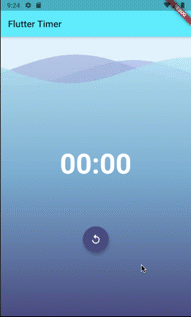

# bloc_timer

Ứng dụng này forked từ [flutter_timer](https://github.com/felangel/bloc/tree/master/examples/flutter_timer).

[Hướng dẫn chi tiết ở đây](https://bloclibrary.dev/#/fluttertimertutorial?id=setup)

Bài tập cho các bạn lớp Flutter Techmaster, hãy convert ứng dụng này sử dụng MobX

