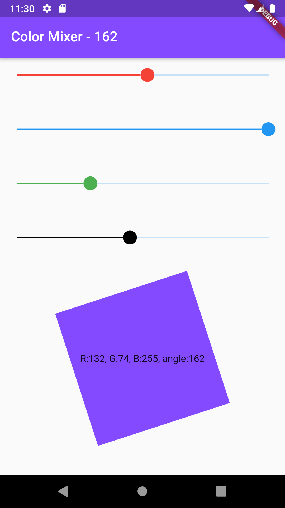

# mobx_color_mixer

Ứng dụng ColorMixer sử dụng MobX để quản lý trạng thái ứng dụng(app state)

## Một số lưu ý

Lệnh để sinh code cho observable state
```
flutter packages pub run build_runner watch
```

Đối tượng quản lý obsevable state được khai báo ở trong class MyApp

```dart
class MyApp extends StatelessWidget {
  final Event event = Event();
  ...
}
```

Để nhiều thành phần giao diện có thể cùng quan sát sự thay đổi trạng thái, chúng ta sẽ truyền đối tượng event vào các custom widget

```dart
MobXMixer(event)
```